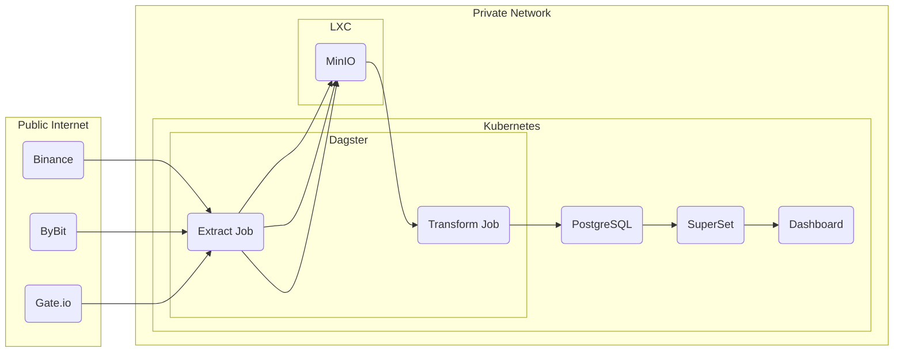
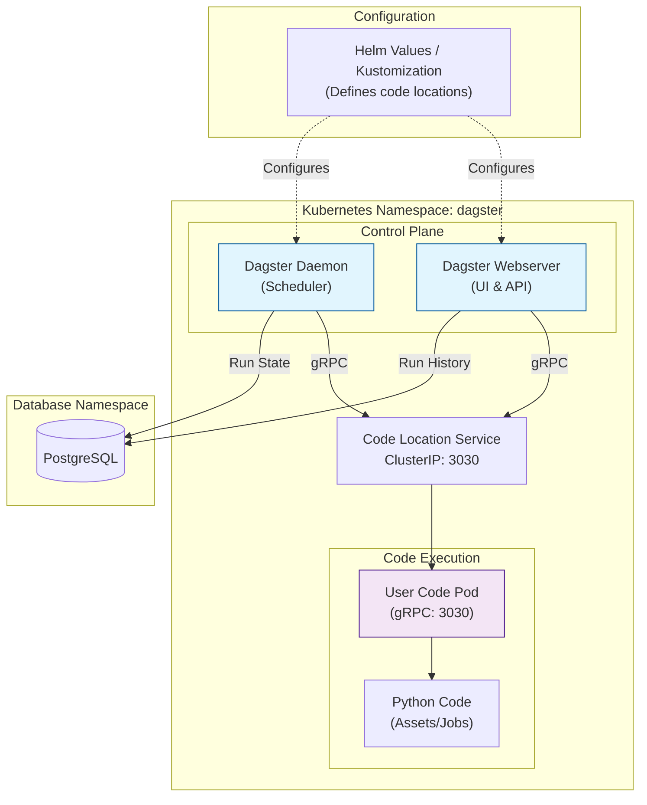

# Dagster Deployment for Kubernetes

Production-ready Dagster deployment using Helm + Kustomize for Kubernetes clusters. This repository provides a complete deployment setup for running Dagster as an orchestration platform for data pipelines.

**Live Example:** Deployed at `dagster.homelab.lan` | **Status:** ✅ Running | **Version:** Dagster 1.12.6

---

## 🎯 Features

- **GitOps-Ready**: Kustomize-based deployment with Helm chart integration
- **Secure by Default**: Sealed Secrets for credential management
- **Production Architecture**: Separation of Dagster instance and code locations
- **Scalable Design**: Supports multiple code locations and horizontal scaling
- **Battle-Tested**: Includes real-world troubleshooting guides and operational procedures

---

## 🏗️ Architecture

### Data Pipeline Flow



### Internal Communication



**Key Design Decisions:**
- **Stateless Dagster Instance**: No persistent volumes required
- **Separate Code Locations**: Jobs run in isolated pods from control plane
- **External Dependencies**: PostgreSQL for metadata, MinIO for raw data storage
- **gRPC Communication**: Webserver/Daemon communicate with code locations via gRPC (port 3030)

---

## 📋 Prerequisites

### Infrastructure Requirements

| Component | Version | Purpose |
|-----------|---------|---------|
| Kubernetes | 1.24+ | Container orchestration |
| PostgreSQL | 17.6.0+ | Dagster metadata storage |
| MinIO (optional) | Latest | Object storage for raw data |
| MetalLB (bare-metal) | Latest | LoadBalancer service support |
| Traefik | Latest | Ingress controller |

### Tools Required

- `kubectl` - Kubernetes CLI
- `kustomize` (v5.0.0+) - Manifest management
- `kubeseal` - Sealed Secrets encryption
- `helm` (optional) - Helm chart management

---

## 🚀 Quick Start

### 1. Clone Repository

```bash
git clone https://github.com/arookieds/dagster-deployment.git
cd dagster-deployment
```

### 2. Create Namespace

```bash
kubectl apply -f base/namespace.yaml
```

### 3. Configure Secrets

Create sealed secrets for PostgreSQL credentials:

```bash
# Create plain secret (DO NOT COMMIT)
kubectl create secret generic postgres-secrets \
  --from-literal=postgresql-password='your-password-here' \
  --namespace dagster \
  --dry-run=client -o yaml > secret.yaml

# Seal the secret
kubeseal -o yaml < secret.yaml > overlays/prod/sealed-secret.yaml

# Clean up plain secret
rm secret.yaml
```

### 4. Update Configuration

Edit `base/kustomization.yaml` to configure:
- Code location servers (workspace.servers)
- PostgreSQL connection details
- Resource limits

### 5. Deploy

```bash
# Deploy using Kustomize
kubectl apply -k overlays/prod

# Verify deployment
kubectl get pods -n dagster
kubectl get svc -n dagster
```

### 6. Access Dagster UI

**Option A: Port Forward (Testing)**
```bash
kubectl port-forward -n dagster svc/dagster-dagster-webserver 3000:80
# Open: http://localhost:3000
```

**Option B: Ingress (Production)**
```bash
# Access via configured domain
curl http://dagster.homelab.lan
```

---

## ⚙️ Configuration

### Helm Values (via Kustomize)

The `kustomization.yaml` includes inline Helm values for the Dagster chart:

```yaml
helmCharts:
  - name: dagster
    repo: https://dagster-io.github.io/helm
    version: 1.12.6
    valuesInline:
      # PostgreSQL connection
      postgresql:
        enabled: false
        postgresqlHost: postgresql.database.svc.cluster.local
        postgresqlDatabase: dagster
        postgresqlUsername: dagster
      
      # Code locations (user deployments)
      dagster-webserver:
        workspace:
          servers:
            - host: "trading-data"
              port: 3030
              name: "trading-data"
```

### Common Customizations

**Add More Code Locations:**
```yaml
workspace:
  servers:
    - host: "crypto-extract"
      port: 3030
      name: "crypto-extract"
    - host: "crypto-transform"
      port: 3030
      name: "crypto-transform"
```

**Enable High Availability:**
```yaml
dagster-webserver:
  replicaCount: 3
```

**Adjust Resource Limits:**
```yaml
dagster-webserver:
  resources:
    limits:
      cpu: 1000m
      memory: 1Gi
    requests:
      cpu: 250m
      memory: 256Mi
```

---

## 📂 Repository Structure

```
dagster-deployment/
├── README.md                          # This file
├── DEPLOYMENT.md                      # Full deployment documentation
├── base/                              # Base Kubernetes resources
│   ├── kustomization.yaml            # Helm chart + base config
│   ├── namespace.yaml                # Namespace definition
│   └── ingressroute.yaml             # Traefik ingress (optional)
└── overlays/
    └── prod/                          # Production environment
        ├── kustomization.yaml        # Production patches
        └── sealed-secret.yaml        # Encrypted secrets
```

**Note**: _overlays_ will be added at a later stage.

---

## 🔧 Troubleshooting

### Issue: Pods Not Starting

**Symptoms:** Pods in `Pending` or `CrashLoopBackOff` state

**Check:**
```bash
# View pod status
kubectl get pods -n dagster

# Check logs
kubectl logs -n dagster <pod-name>

# Check events
kubectl describe pod -n dagster <pod-name>
```

**Common Causes:**
- Missing secrets: Ensure `postgres-secrets` sealed secret exists
- PostgreSQL unreachable: Verify PostgreSQL pod running in `database` namespace
- Resource limits: Check if pod is OOMKilled due to memory limits

### Issue: Cannot Access UI

**Symptoms:** `curl http://dagster.homelab.lan` returns connection refused or 404

**Diagnosis:**
```bash
# Find actual service name created by Helm
kubectl get svc -n dagster

# Expected: dagster-dagster-webserver
```

**Fix:** Update `ingressroute.yaml` to use correct service name:
```yaml
services:
  - name: dagster-dagster-webserver  # Not just "dagster"
    port: 80
```

**Helm naming convention:** `{releaseName}-{chartName}-{componentName}`

### Issue: Code Location Not Loading

**Symptoms:** Dagster UI shows "Code location unavailable"

**Check gRPC connectivity:**
```bash
# Verify code location pod running
kubectl get pods -n dagster -l component=user-code

# Check webserver can reach code location
kubectl exec -n dagster <webserver-pod> -- \
  nc -zv <code-location-service> 3030
```

**Common Causes:**
- Service name mismatch in `workspace.servers` configuration
- Code location pod not running
- gRPC port 3030 not exposed in code location service

---

## 📖 Full Documentation

For comprehensive deployment documentation including:
- Detailed architecture explanations
- Backup and restore procedures
- Monitoring and alerting setup
- Migration paths and scaling strategies
- Complete troubleshooting guide

See [DEPLOYMENT.md](./DEPLOYMENT.md)

---

## 🎯 Use Cases

This deployment is designed for:

- **Data Engineering Pipelines**: ETL/ELT workflows for batch processing
- **Financial Data Processing**: Crypto market data extraction and transformation
- **ML Pipeline Orchestration**: Scheduling model training and inference
- **Multi-tenant Deployments**: Separate code locations per team/project

**Not suitable for:**
- Real-time streaming (use Kafka/Flink for high-frequency data)
- Extremely high-throughput (>10k jobs/minute)
- Windows-based deployments (Linux containers only)

---

## 🔐 Security Considerations

- **Sealed Secrets**: All credentials encrypted using Sealed Secrets controller
- **No External Exposure**: Dagster UI accessible only within cluster network or via VPN
- **Namespace Isolation**: Runs in dedicated `dagster` namespace
- **Minimal Privileges**: Service accounts follow principle of least privilege

**For Production:**
- Enable authentication (OAuth2, LDAP, SAML)
- Implement Network Policies for namespace isolation
- Use separate PostgreSQL instance (not shared)
- Enable TLS for gRPC communication

---

## 🤝 Contributing

Contributions welcome! Please follow these guidelines:

1. **Fork** the repository
2. **Create** a feature branch (`git checkout -b feature/amazing-feature`)
3. **Commit** your changes (`git commit -m 'Add amazing feature'`)
4. **Push** to the branch (`git push origin feature/amazing-feature`)
5. **Open** a Pull Request

**Please include:**
- Description of changes
- Rationale for the change
- Testing performed (include kubectl commands and output)
- Documentation updates (if applicable)

---

## 📝 License

This project is licensed under the MIT License - see [LICENSE](LICENSE) file for details.

---

## 🙏 Acknowledgments

- **Dagster Team** - For the excellent orchestration framework
- **Bitnami** - For well-maintained Helm charts
- **Kubernetes Community** - For robust container orchestration

---

## 📞 Support

- **Issues**: [GitHub Issues](https://github.com/arookieds/dagster-deployment/issues)
- **Discussions**: [GitHub Discussions](https://github.com/arookieds/dagster-deployment/discussions)
- **Dagster Slack**: [dagster.slack.com](https://dagster.slack.com)

---

## 🗓️ Changelog

| Date | Version | Changes |
|------|---------|---------|
| 2025-12-14 | 1.0.0 | Initial public release |
| 2025-12-12 | 0.9.0 | Internal deployment and testing |

---

**⭐ If this repository helped you, please consider giving it a star!**
